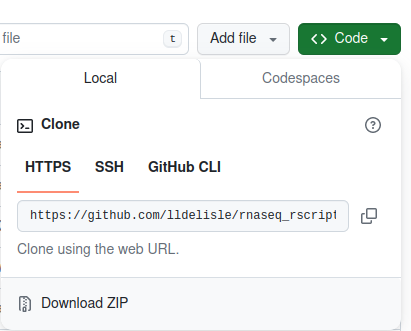

# Start your analysis

## First get all scripts

There are 2 ways to get the scripts. If you are familiar with command lines, you can clone the repository where you want:
```bash
git clone https://github.com/lldelisle/rnaseq_rscripts.git
```
Alternatively, you can simply download the repository:


## Then create your samples plan

Read the documentation about this file [here](./Documentation.md#samplesplan). Do not forget the 2 columns `hts_count_file` and `cufflinks_file`.

## Start with step1

Modify the file `example/configFileRNAseq_step1.R` to fit what you want and what you need. You can have more details on each parameter [here](./Documentation.md#)
Open the file `step1-generateTables.R` in RStudio and source and follow instructions in the console of RStudio.

## Run step3

I know it is counter intuitive but I suggest to start with step3 to see how your samples behave (which one is close to which one).
Again, first modify the config file and use your FPKM table subset, and then source the `step3-grapfClusteringPCAGenes.R`.

## Run step2 or step2 multi

If you have only 2 conditions, run the step2. If you have more than 1 comparison, I propose to use step2-multi.
For both, modify the config file, and then source `step2-DESeq2.R` or `step2-multi_DESeq2.R`.
